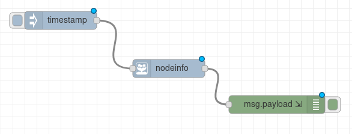

# node-red-openfaas-auth

Integrate your OpenFaaS functions into NodeRED.

## Features

- OpenFaaS server configuration shared between function nodes
- Fetching functions from server and showing them in a dropdown
- JWT, API Key Authentication for functions endpoint
- Standard Authentication for admin endpoint
- *Cool* OpenFaaS logo
